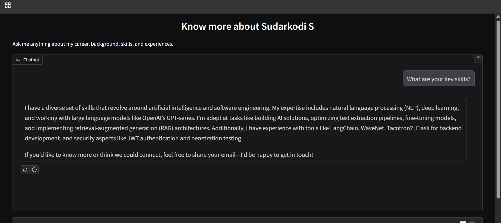

# AI Career Agent 🤖

Personal AI agent that answers career questions and captures leads automatically. Built with CrewAI during the AI Agents workshop at iamneo.ai, Coimbatore.



## What it does

- Answers questions about your career/skills in first-person
- Parses your resume PDF
- Sends email notifications when someone wants to connect
- Chat UI powered by Gradio

## Quick Setup

```bash
# Install
pip install crewai gradio pypdf python-dotenv

# Create .env file
GMAIL_USER=your-email@gmail.com
GMAIL_APP_PASSWORD=your-app-password
NOTIFICATION_EMAIL=where-to-receive@gmail.com

AZURE_API_BASE=your-azure-endpoint
AZURE_API_KEY=your-azure-key

# Run
python main.py
```

## Files needed

```
files/
├── your-resume.pdf
└── summary.txt
```

## How it works

The agent uses your resume to answer questions naturally. When visitors share their email or ask something important, you get notified automatically.

**Note**: Get Gmail app password from Google Account Settings → Security → App Passwords

## Built with

CrewAI • Azure OpenAI (GPT-4o) • Gradio • PyPDF

---

Made at the AI Agents vs Agentic AI workshop 🚀